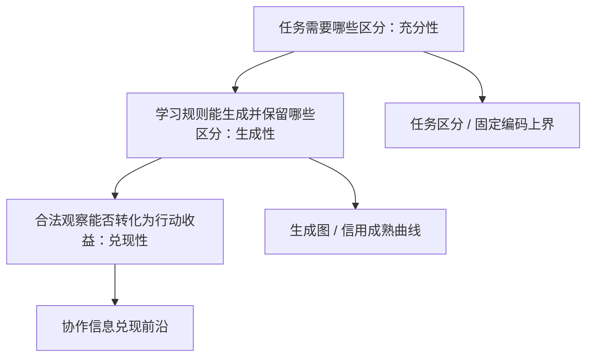

# 协议形成与任务区分的可学习性：当前项目架构与研究规划

整理日期：2026-09-08  
资料范围：`研究阅读与提示词包.zip`、`后续诊断最小实验资产.zip`  
项目阶段：历史四条主线均已封账；下一阶段处于机制定义与实验预注册之前

## 1. 一句话定位

本项目不是继续堆叠 MoE 层级或调参追求更高准确率，而是研究一个更基础的问题：

> 在通信容量足够、充分协议确实存在、局部训练目标也能被执行的条件下，任务所需的“新区分”为何仍可能无法被双方共同生成、获得信用并长期保留？

因此，当前项目应被定义为一个**以反例、结构判据和最小机制实验为核心的可证伪研究程序**，而不是某个单一模型工程。

## 2. 项目目标分层

| 层级 | 目标 | 当前状态 | 成功标准 |
|---|---|---|---|
| 远期问题 | 理解模块化智能系统如何形成可用的协作协议 | 仅有有限任务证据 | 跨任务、跨实现、跨规模仍能预测协议形成与失败 |
| 中期理论目标 | 区分“物理容量、任务信息、学习可达性、行动兑现性” | 已形成初步框架 | 概念能给出额外预测、反例和可计算判据 |
| 当前机制目标 | 判断有益的新编码区分是否因“即时信用不利”而被拒绝 | 尚未验证 | 预注册观察到 `C0 ≤ 0`、`CT > 0`，且超过原编码适应与随机改写 |
| 当前工程目标 | 建立不会污染历史证据、可运行新诊断的实验骨架 | 资产已具备，入口尚未建立 | 只读加载冻结资产；训练、评价、审计物理隔离；结果可复核 |

## 3. 总体研究架构



三层分别回答：

1. **充分性**：消息划分是否保留了解题所需的信息？
2. **生成性**：在给定更新规则与预算下，系统是否能从当前协议走到充分协议？
3. **兑现性**：即使候选中存在有用信息，合法可见特征是否足以选择正确行动？

这三层不能混为一谈。`4 bit` 物理带宽足够，不代表当前编码包含足够任务信息；存在 100% 的解，不代表训练规则可达；oracle 有收益，也不代表合法 selector 能兑现收益。

## 4. 历史证据架构

### 4.1 四条主线及其角色

| 主线 | 研究问题 | 最重要结论 | 对当前项目的作用 | 状态 |
|---|---|---|---|---|
| A. MoE → 心智社会 | 专家、角色、状态与组织是否产生超出等计算冗余的能力 | L2 有部分功能分化；L3/L4 未建立独立组织收益；合法故障特征 AUROC 约 0.45–0.53 | 引出“候选存在”与“合法选择可行”之间的差异 | 故障恢复路线封账 |
| B. 认知割容量 | 带宽足够时为何仍学不会任务信息 | 保持硬前向和梯度范数，只替换信用方向，可使约 49.72% 恢复到 100% | 确认当前系统中局部信用方向具有因果作用 | 完成机制定位并封账 |
| C. 离散反事实信用 | 不给 sender 正确码标签，能否用任务反馈产生信用 | 固定语义 receiver 下，16 码全搜索稳定 100%；8 码接近全搜索；低预算稳定性不足 | 证明“已有语义接口的使用”可学，但未解决语义形成 | 固定语义与低查询路线封账 |
| D. 联合协议学习 | 双方从零能否形成充分协议 | J-E16 约 29.91%；分组目标 J-GROUP16 约 30.33%，且编码上界下降 | 暴露“目标能拟合，但新区分仍不产生”的核心异常 | 逐行/分组硬目标分支封账 |

四条主线、30 个异质编号单元不能解释成 30 次独立失败；B/C/D 共 516 次有效训练也不能解释成 516 项独立发现。大量运行属于共享任务、共享初始化、精确复现或配对对照。

### 4.2 研究对象如何逐步收缩


这条演进说明当前不应回到“再加专家、再训更久、再调温度”的旧问题。新的研究增量来自对协议改写路径和时间尺度的刻画。

## 5. 当前最小实验系统

### 5.1 任务与数据

- `x`：8 bit，分为两个 4 bit 块。
- `q ∈ {0,1}`：选择其中一块。
- 任务充分变量 `V`：低三位取所选块前三位，最高位取另一块的 bit0。
- `r`：4 bit，遍历 0–15。
- 输出：`Y = (int(V) + int(r)) mod 16`，以 4 bit 表示。
- 完整状态空间：`256 × 2 × 16 = 8192`。
- 三个 split：9001/9002/9003；每个 split 按完整 `x` 互斥划分为 128 个训练、32 个验证、96 个测试输入。

这不是 XOR 任务，也不是直接复制所选 4 bit 块。以后实现任务重建时必须以冻结源码和完整 8192 状态匹配为准。

### 5.2 模型与信息边界

| 模块 | 合法输入 | 禁止输入 | 当前结构 |
|---|---|---|---|
| Sender | `x, q` | `r, V`、测试信息 | 10→64→64→8，实际前 4 位硬化为消息，后 4 位补零 |
| Receiver | `m, q, r` | `x`、group ID、`V` | 22→64→64→4 |
| 训练目标构造器 | 合法训练数据与当前 receiver 的候选损失 | 验证/测试标签、历史 oracle 缓存 | 对 16 个离散消息评分 |
| 隔离评价器 | 冻结模型、完整评价数据、`V` | 反向影响训练或候选选择 | 计算任务准确率、`A_code`、互信息和干预 |

虽然文件层面可将 `V` 放入 `evaluation_only`，但 `V` 能从 `y,r` 反推出，因此必须按**实际监督内容**而不是文件名审计信息权限。

### 5.3 核心评价量

| 指标 | 回答的问题 | 不能被误解为 |
|---|---|---|
| 任务准确率 `A` | 当前 sender + receiver 最终是否答对 | 仅编码质量 |
| 固定编码上界 `A_code` | 固定 sender 编码后，理想 decoder 最多能多好 | 编码机制的因果贡献率 |
| `I(V;M|q)` | 消息在给定上下文下保留多少任务信息 | 信息结构充分性的完整替代 |
| 常量消息干预下降 | 系统是否真正使用消息 | 已形成充分协议 |
| 目标拟合率 / 消息翻转率 | sender 是否执行当前局部目标 | 双方是否达到联合全局最优 |

最新 J-GROUP16 的平均 `A = 0.303277`，`A_code = 0.402778`。因此：

`1 − A = (1 − A_code) + (A_code − A) = 0.597222 + 0.099501`。

在当前确定性、完整 `r` 支持和可逆加法任务下，前项表示固定编码导致、仅更换 decoder 无法消除的错误；后项表示当前 decoder 相对该编码上界的差距。`0.597222 / (1 − A) ≈ 85.72%` 只是**当前错误的结构分解比例**，不是“编码机制对失败贡献了 85.72%”的因果结论。

## 6. 当前最关键的实证异常

实验 02 中，J-GROUP16 将同一 `(x,q)` 的 16 个 `r` 对应目标统一为一个共同最优消息。干预经过审计，且多数模型已几乎完全执行：

- 六个模型末 10 轮整码目标拟合率为 99.0234%–100%。
- 四个模型达到 100% 拟合、消息翻转率为 0、共同消息经验后悔值为 0。
- 但其训练任务信息仍只有约 1.99–2.51 bit。
- 平均 test 只从 29.9099% 增至 30.3277%，`A_code` 反而从 45.9201% 降至 40.2778%。

所以当前最值得解释的不是“sender 为什么没学会目标”，而是：

> 为什么当前 receiver 所定义、sender 也完全执行的共同最优消息，仍然维持一个信息不足的约定？

零单边后悔只说明当前 receiver 下没有更好的单步消息，不能推出不存在经 receiver 适应后更好的协议改写。

## 7. 三个候选理论组件

### 7.1 C1：任务区分生成图

- 节点：协议诱导的输入划分，以及足以预测下一步转移的 receiver/优化状态摘要。
- 边：学习规则允许的协议改写，标注成本、概率、损失和信息变化。
- 用途：判断充分协议是否存在但被当前更新规则隔绝；搜索中性路径或正损失屏障。
- 风险：仅用“输入划分”可能不具 Markov 性；若必须携带完整网络状态，图会失去压缩价值。

### 7.2 C2：信用成熟曲线

令 `R_T[S']` 表示 receiver 从统一初态针对编码 `S'` 适应 `T` 步后的状态，定义：

`C_T(S→S') = L(S, R_T[S]) − L(S', R_T[S'])`。

- `C0 ≤ 0`、`CT > 0`：改写即时不利，但经双方匹配适应后有利。
- 用途：直接区分“没有价值”与“价值尚未成熟”。
- 优点：最接近现有异常，最早能产生额外、可证伪预测。
- 风险：高度依赖适应预算 `T`、优化器状态和候选改写语法，必须预注册。

### 7.3 C3：协作信息兑现前沿

- 描述在合法观察与成本预算下，候选信息最多能转化为多少行动收益。
- 最适合解释 MoE V7 中“oracle 有 6.25 pp 恢复空间，但合法特征 AUROC 接近随机”的现象。
- 当前不是下一轮联合协议实验的首要工具；其新颖性还需与价值信息、理性不注意和协调博弈文献核对。

当前优先级为：`C2 信用成熟曲线 > C1 任务区分生成图 > C3 协作信息兑现前沿`。

## 8. 两个压缩包构成的资产架构

### 8.1 阅读与决策层

`研究阅读与提示词包.zip` 包含：

- 当前研究上下文与科学约束；
- 四条历史主线的总结和原始报告副本；
- 概念驱动科学发现范式；
- 下一步机制诊断草案；
- 清单、来源记录和完整性校验脚本。

它用于回答“已经知道什么、不能声称什么、下一步为何值得做”。清单校验 18 项全部通过。

### 8.2 冻结实验与诊断层

`后续诊断最小实验资产.zip` 的内部结构是：

| 目录/文件 | 角色 | 使用规则 |
|---|---|---|
| `models/` | 12 个 joint02 模型的最终、初始、epoch100 与 sender 阶段快照 | 只读；作为下一轮六个主模型及六个历史锚点 |
| `training_data/` | 三个 split 的合法 `x,q,r,y` 与分组索引 | 训练/适应唯一数据入口 |
| `evaluation_only/` | 完整 8192 状态和 `V` | 必须与训练进程隔离 |
| `frozen_sources/` | 历史网络、训练、分组目标及审计源码 | 作为实现权威；不可直接当新实验入口 |
| `historical_run/` | 历史指标、诊断、配置、审计与来源清单 | 只读证据账本 |
| `evaluate_frozen.py` | 最终 checkpoint 的便携评价入口 | 只评价，不重放训练 |
| `OMITTED_JOINT02.json` | 未打包的完整历史重放文件清单 | 明确复现边界 |

清单校验 131 项全部通过。当前包保留 12 个模型、完整配对和最终诊断需要的关键材料，但省略了 4,815 个完整历史逐步重放所需文件，也不包含前三条主线的模型数据。因此它是**最小冻结诊断包**，不是**全项目复现包**。当前运行环境缺少 PyTorch，尚未重新执行 36 个最终分区评价。

## 9. 建议的新项目工程结构

历史资产应保持只读，新实验另建根目录，避免覆盖证据：

```text
protocol_distinction_lab/
├── docs/
│   ├── PROJECT_ARCHITECTURE.md
│   ├── EVIDENCE_LEDGER.md
│   ├── HYPOTHESES.md
│   └── preregistrations/
├── evidence_readonly/
│   ├── reading_pack/
│   └── joint02_minimal_assets/
├── src/protocol_lab/
│   ├── task.py
│   ├── protocol.py
│   ├── rewrites.py
│   ├── adaptation.py
│   ├── metrics.py
│   └── permissions.py
├── exact_lab/
│   ├── enumerate_protocols.py
│   ├── search_neutral_paths.py
│   └── counterexamples/
├── experiments/
│   └── cm01_credit_maturation/
│       ├── PLAN.md
│       ├── config.lock.json
│       ├── run.py
│       └── audit.py
├── tests/
└── results/
    └── cm01_credit_maturation/<run_id>/
```

关键工程原则：

1. `evidence_readonly` 永不写入；新输出只进入新的 `results/<run_id>`。
2. 任务定义只有一个权威实现，并另用独立函数式实现审计。
3. 训练与评价分别启动进程，使用输入白名单；评价文件不挂载给训练进程。
4. 配置、种子、候选语法、预算、门槛和源码哈希在运行前冻结。
5. 每个结果明确标为“历史实测、当前推导、待检验假说或研究建议”。

## 10. 下一阶段路线图

### 阶段 0：资产接收与基线确认

**目的**：确认新工程读取的是正确历史对象，而不是重做旧实验。

交付物：

- 两包清单校验报告；
- 新环境记录；
- 12 个 checkpoint 的只读索引；
- 在具备 PyTorch 2.2.2/NumPy 1.26.4 的环境中运行 `evaluate_frozen.py`，报告跨平台差异；
- 明确不能完成全历史训练重放的 4,815 个缺失文件。

退出条件：最终评价与历史指标误差不超过冻结的 `1e-6`，或如实记录平台差异并停止宣称精确复现。

### 阶段 1：精确小空间机制搜索——推荐的唯一首要动作

**目的**：在二状态/二消息以及逐步扩展的小型表格系统中，先验证“信用成熟”是否真的产生新的可观察预测。

应枚举：

- 任务表、sender 编码、receiver 解码表；
- 单样本改写、成组改写、码交换；
- receiver 适应 0…T 步后的损失；
- 是否存在零成本中性路径、是否必须跨越正损失屏障；
- 在消息重命名同构下去重后的协议划分。

核心输出不是更高准确率，而是一组最小反例：充分协议存在，但当前单步规则拒绝某个 `S'`，同时 `C0 ≤ 0`、`CT > 0`。若搜索不到，应先修正概念或候选规则，不进入神经训练。

### 阶段 2：冻结 CM01 神经机制实验方案

唯一问题：**当前 receiver 否决的合法编码改写，在等预算适应后，能否产生可重复收益并增加必要任务信息？**

冻结前必须确定：

- 候选改写语法、数量、种子、复杂度与选择规则；
- 唯一主要适应步数 `T` 和总计算预算；
- 优化器采用“复制 epoch100 状态”还是“两分支统一重置”；
- 主要任务损失、准确率与 `A_code` 的预设效应阈值；
- 改动比例匹配的随机改写对照；
- 历史诊断集和真正未参与设计的确认条件；
- 多候选选择校正、失败定义和停止条件。

任何利用 `V`、完整答案轮廓或历史测试错误选择候选的方案，只能标为 oracle 诊断上界，不能称为自主协议形成。

### 阶段 3：执行四分支信用成熟诊断

对全部六个 J-GROUP16 最终模型进行配对：

| 分支 | 编码 | Receiver | 作用 |
|---|---|---|---|
| A | 原编码 `S` | 固定 | 原即时基线 |
| B | 改写编码 `S'` | 固定 | 计算即时信用 `C0` |
| C | 原编码 `S` | 等预算适应 T 步 | 排除普通 receiver 增训收益 |
| D | 改写编码 `S'` | 等预算适应 T 步 | 计算成熟信用 `CT` |

主支持模式必须同时满足：

- `C0 ≤ 0` 而 `CT > 0`；
- 改写增加必要任务信息；
- D 相对 C 的收益超过预设阈值；
- 优于变化比例匹配的随机改写；
- 在预先指定的配对汇总与确认条件中重复出现。

这一阶段只能证明“有益改写存在但当前评分可能漏掉”，不能证明 sender 能自主发现或实现该改写。

### 阶段 4：根据结果分流，而不是自动进入下一轮

| 结果 | 解释优先级 | 下一动作 |
|---|---|---|
| `C0≤0, CT>0` 且信息增加 | 有限支持信用成熟机制 | 单独设计“合法信号如何提出改写”的生成实验 |
| 改写有信息，但适应后仍无收益 | receiver 适应或表示瓶颈 | 检查可解码性和训练动力学，不扫描旧超参数 |
| 原编码适应与改写同样提升 | 普通 receiver 训练不足 | 不把收益归因于协议改写 |
| 候选均无信息增量 | 候选生成器失败 | 回到精确生成图改进候选语法，不能否定整个理论 |
| 有益改写即时已经有利 | sender 发现/实现困难更可疑 | 另做 sender 拟合与探索实验 |
| 全部失败且候选有效 | 信用成熟假说被当前证据削弱 | 封账 CM01，重新排序 C1/C3 或新机制 |

### 阶段 5：满足门槛后才扩展

只有 CM01 提供明确机制证据后，才考虑：

1. 由合法训练信号自主生成协议改写；
2. 独立实现与全新任务族确认；
3. 扩大消息空间并研究搜索复杂度；
4. 连续消息、长时序与多代理拓扑；
5. 将 C3 用于组织选择和 MoE 信息兑现问题。

当前不应直接扩大到自然语言、大模型或多代理社会，因为那会同时引入任务、表示、优化和评价四类混杂因素。

## 11. 项目治理与决策门

| 决策门 | 必须回答 | 不通过时 |
|---|---|---|
| G0 资产有效性 | 文件、任务重建、数据权限和基线是否可信 | 停止科学解释，版本化修复并保留失败记录 |
| G1 概念增量 | C2 是否给出旧指标没有的独特预测 | 停止命名扩张，回到反例与定义 |
| G2 机制证据 | 四分支结果是否排除普通增训和随机改写 | 不宣称信用成熟得到支持 |
| G3 自主生成 | 不使用 `V` 的系统能否提出并保留有益改写 | 不进入规模扩展 |
| G4 外部有效性 | 新任务、更多 seed、独立实现是否复现 | 将结论限制在当前 toy 系统 |

## 12. 当前明确禁止的工作

- 不恢复分组软化、混合比例、学习率、预热、更多 seed 或延长 epoch 的旧扫描。
- 不把 16 码全搜索称为协议空间全搜索。
- 不把目标一致、零后悔、高消息熵或消息非恒定单独当作协议充分证据。
- 不把 `A_code` 错误分解当作因果贡献分解。
- 不把同一代理的第二套审计实现称为外部复现。
- 不把历史测试集包装成全新确认集。
- 不因某个有利配对或末段仍上升而事后改变门槛。
- 不把 toy 任务上的结论直接外推成 AGI 普遍理论。

## 13. 当前项目状态看板

| 项目项 | 状态 |
|---|---|
| 历史证据整理 | 已完成 |
| 两包文件完整性校验 | 已通过 |
| 旧四条实验主线 | 已封账/停止扩展 |
| 最新 12 模型与最小诊断资产 | 已具备 |
| 冻结 checkpoint 跨平台重新评价 | 未完成，当前环境缺少 PyTorch |
| 信用成熟精确小实例搜索 | 未开始 |
| CM01 候选改写与阈值预注册 | 未完成 |
| CM01 神经诊断 | 未执行 |
| 自主候选生成与规模扩展 | 暂不启动 |

## 14. 总结性决策

建议把项目正式拆成三部分：

1. **Evidence Ledger**：冻结保存 A–D 四条主线和所有阴性结果；
2. **Theory Lab**：围绕任务区分、协议改写、信用成熟和可达路径做精确推导与小枚举；
3. **Mechanism Lab**：只执行通过预注册的单因素诊断，并由独立评价/审计层核验。

唯一首要动作是：**先完成小型表格协议空间中的信用成熟与中性路径精确搜索，再据此冻结 CM01 的候选改写语法。**这一步成本低、最能检验 C2 是否真的增加预测，也能避免再次把一个未经证明的故事直接变成大规模神经训练。

## 15. 主要资料依据

- `01_研究上下文.md`
- `04_下一步机制诊断草案.md`
- `原始报告/RESEARCH_ROUTE_INVENTORY.md`
- `原始报告/moe_society_minimal_lab/FINAL_PROJECT_REPORT.md`
- `原始报告/cognitive_cut_capacity/EXPERIMENT_CLOSURE_AND_RESEARCH_ROADMAP.md`
- `原始报告/discrete_counterfactual_credit/EXPERIMENT_CLOSURE_AND_RESEARCH_ROADMAP.md`
- `原始报告/joint_protocol_learning/EXPERIMENT_CLOSURE_AND_RESEARCH_ROADMAP.md`
- `原始报告/joint_protocol_learning/results/20260907-joint01-r2/RESULTS_REPORT.md`
- `原始报告/joint_protocol_learning/results/20260907-joint02/RESULTS_REPORT.md`
- `原始报告/joint_protocol_learning/results/20260907-joint02/RESEARCH_DECISION.md`
- `02_实验资产/README.md`
- `02_实验资产/frozen_sources/EXPERIMENT_02_PLAN.md`
